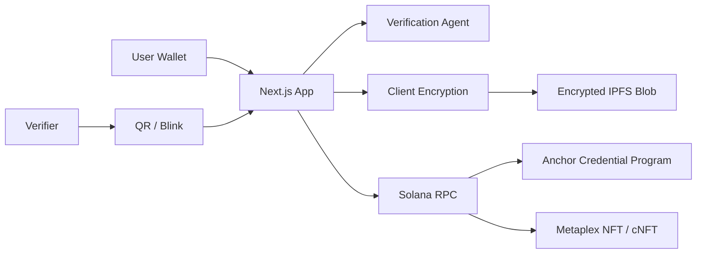

# NomadPass Architecture

## MVP Boundary

- The web app is fully demoable.
- The Anchor program defines the production onchain surface.
- IPFS uses Pinata when `PINATA_JWT` exists and a demo CID otherwise.
- The frontend currently produces demo Solana references until a deployed program ID and wallet transaction builder are connected.

## Production Upgrade Path

1. Install Solana CLI and Anchor.
2. Replace the placeholder program ID.
3. Deploy to devnet.
4. Generate the Anchor IDL.
5. Wire `create_credential`, `verify_credential`, and `create_share_grant` from the app.
6. Replace standard NFT minting with Bubblegum V2 cNFTs for scale.
